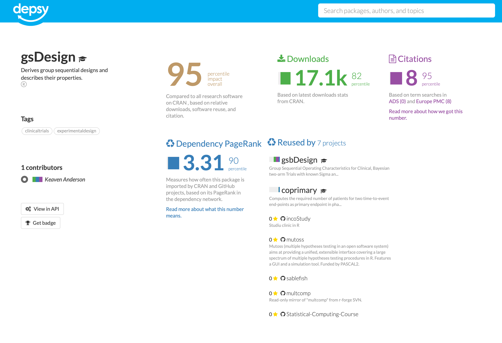
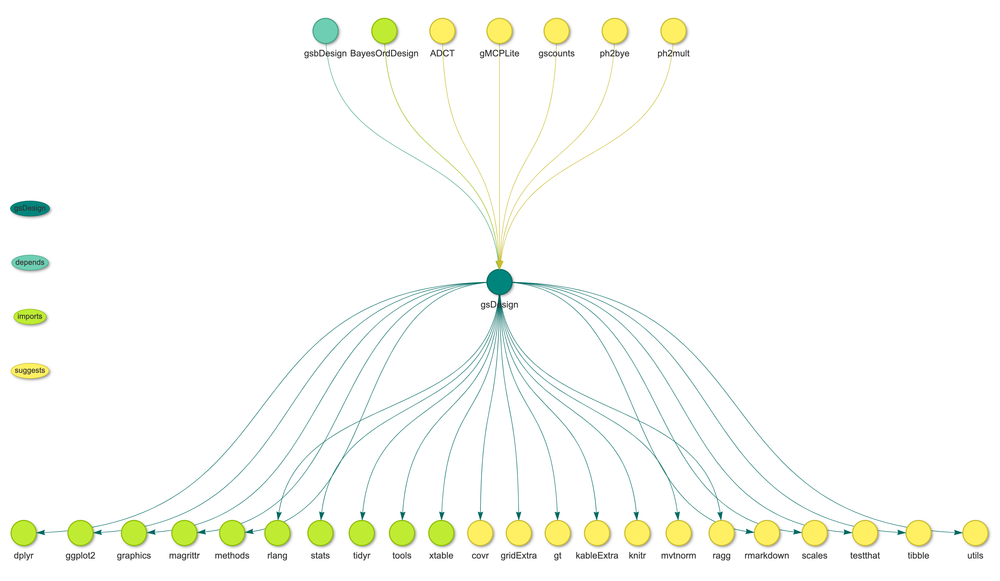
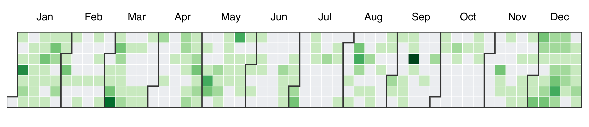

<!-- README.md is generated from README.Rmd. Please edit that file -->

```{r, include=FALSE}
knitr::opts_chunk$set(
  collapse = TRUE,
  comment = "#>",
  echo = FALSE,
  fig.path = "images/",
  fig.width = 7.2916667,
  dev = "ragg_png",
  dpi = 300,
  cache = TRUE
)
```

# gsDesign-metrics

<!-- badges: start -->
<!-- badges: end -->

Impact metrics and summaries for gsDesign.

```{r, include=FALSE}
library("ggplot2")
library("prophet")
library("patchwork")
```

## Downloads

Monthly downloads on Posit CRAN mirror for gsDesign from 2014-01-01 to 2022-11-30.

```{r}
dl <- cranlogs::cran_downloads(package = "gsDesign", from = "2014-01-01", to = "2022-11-30")
names(dl) <- c("ds", "y", "package")

df <- aggregate(list(y = dl$y), by = list(ds = cut(as.POSIXct(dl$ds), "month")), sum)
df$ds <- as.Date(as.character(df$ds))
df$"package" <- "gsDesign"
```

```{r, downloads, message=FALSE, fig.asp=1/1.618}
df |>
  ggplot(aes(x = ds, y = y, color = package)) +
  geom_point() +
  geom_smooth(method = "gam", level = 0.95) +
  scale_color_manual(values = "#00857C") +
  cowplot::theme_cowplot() +
  theme(axis.title.x = element_blank()) +
  ylab("Downloads")
```

## Downloads seasonality

Fitting the non-linear trends in the download counts with an additive model, separating into overall trend, weekly seasonality, and yearly seasonality.

```{r, downloads-components, fig.asp=1}
m <- suppressMessages(prophet(dl))
future <- make_future_dataframe(m, periods = 1)
forecast <- predict(m, future)
p <- prophet_plot_components(m, fcst = forecast, render_plot = FALSE)
p1 <- p[[1]] + geom_line(color = "#00857C") + cowplot::theme_cowplot() + xlab("Year")
p2 <- p[[2]] + geom_line(color = "#00857C") + cowplot::theme_cowplot()
p3 <- p[[3]] + geom_line(color = "#00857C") + cowplot::theme_cowplot()
p1 + p2 + p3 + plot_layout(nrow = 3, byrow = FALSE)
```

## Community impact

```{r, out.width="100%"}

```

From <http://depsy.org/package/r/gsDesign>

## Dependency network

```{r, eval=FALSE}
library("crandep")
library("visNetwork")

df_deps <- get_dep("gsDesign", type = "all")
for (i in 1:nrow(df_deps)) {
  if (isTRUE(df_deps[i, "reverse"])) {
    tmp <- df_deps[i, "from"]
    df_deps[i, "from"] <- df_deps[i, "to"]
    df_deps[i, "to"] <- tmp
  }
}

nodes <- data.frame(
  "id" = unique(c(df_deps$from, df_deps$to)),
  "label" = unique(c(df_deps$from, df_deps$to))
)

tmp1 <- df_deps[df_deps$reverse == FALSE, c("to", "type")]
tmp2 <- df_deps[df_deps$reverse == TRUE, c("from", "type")]
names(tmp1) <- c("id", "type")
names(tmp2) <- c("id", "type")
tmp <- rbind(tmp1, tmp2)
nodes$"group" <- tmp[match(nodes$"id", tmp$"id"), "type"]
nodes[1, "group"] <- "self"

edges <- df_deps[, c("from", "to")]

palette <- RColorBrewer::brewer.pal(4, "Pastel1")

visNetwork(nodes, edges, height = "800px", width = "100%") |>
  visNodes(borderWidth = 2, font = list(size = 18)) |>
  visEdges(
    arrows = list(to = list(enabled = TRUE, scaleFactor = 1)),
    smooth = list(type = "cubicBezier", roundness = 0.6)
  ) |>
  visGroups(groupname = "self", color = palette[1], shadow = list(enabled = TRUE)) |>
  visGroups(groupname = "imports", color = palette[2], shadow = list(enabled = TRUE)) |>
  visGroups(groupname = "suggests", color = palette[3], shadow = list(enabled = TRUE)) |>
  visGroups(groupname = "depends", color = palette[4], shadow = list(enabled = TRUE)) |>
  visHierarchicalLayout(
    enabled = TRUE,
    direction = "UD", levelSeparation = 500,
    sortMethod = "directed",
  )
```

CRAN package dependency network for gsDesign:

```{r, out.width="100%"}

```

## Language metrics

Count lines of code, comments, and whitespaces in gsDesign.

```{r cloc}
# remotes::install_github("hrbrmstr/cloc")
df_cloc <- cloc::cloc_cran("gsDesign", repos = "https://cloud.r-project.org/")
df_cloc$"source" <- NULL
df_cloc$"pkg" <- NULL
df_cloc |> knitr::kable(format = "markdown", col.names = c("Lang", "# Files", "(%)", "LoC", "(%)", "Blank lines", "(%)", "# Lines", "(%)"), digits = 2)
```

## Commit history calendar graph

```{bash, eval=FALSE}
git clone git@github.com:keaven/gsDesign.git
cd gsDesign
git log --date=short --pretty=format:%ad | sort | uniq -c > commits.txt
```

```{r, eval=FALSE}
commits <- read.table("commits.txt")
names(commits) <- c("count", "date")
commits$date <- as.Date(commits$date)
commits$date <- format(commits$date, format = "%m-%d")
df_commits <- aggregate(count ~ date, commits, sum)
df_commits$date <- as.Date(paste0("2022-", df_commits$date))
names(df_commits) <- c("day", "value")

nivocal::nivocal(
  df_commits,
  direction = "horizontal",
  colors = RColorBrewer::brewer.pal(n = 9, "Greens")[3:9],
  monthBorderColor = "#333333",
  dayBorderColor = "#ffffff",
  emptyColor = "#ebedf0"
)
```

Distribution of the commits at each day of year from 2008 to 2022.

```{r, out.width="100%"}

```

## Development history

gsDesign: 15 years of development in 5 minutes

[](https://youtu.be/_ZUddQAhPFw)
