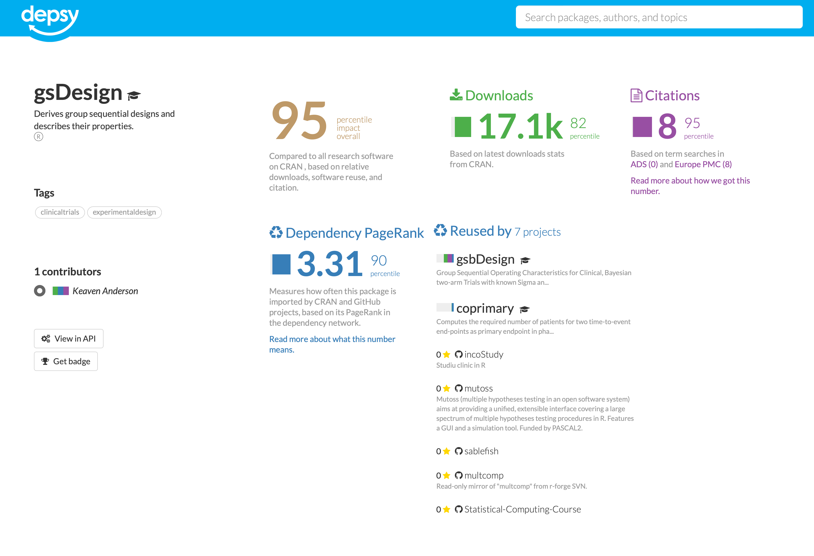
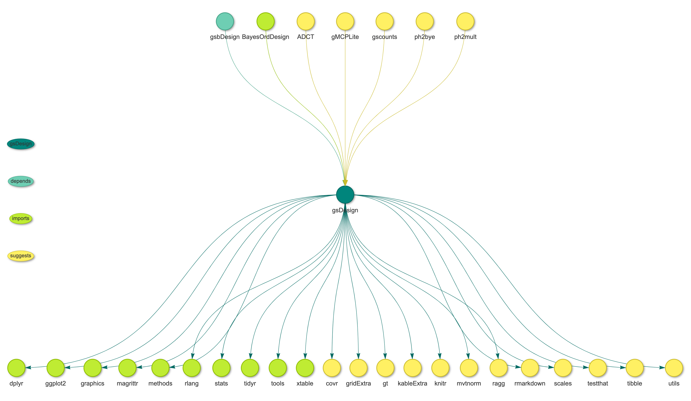
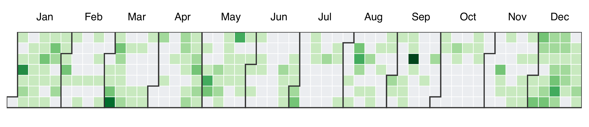

<!-- README.md is generated from README.Rmd. Please edit that file -->

# gsDesign-metrics

<!-- badges: start -->
<!-- badges: end -->

Impact metrics and summaries for gsDesign.

## Downloads

Monthly downloads on Posit CRAN mirror for gsDesign from 2014-01-01 to
2022-11-30.

<!-- -->

## Downloads seasonality

Fitting the non-linear trends in the download counts with an additive
model, separating into overall trend, weekly seasonality, and yearly
seasonality.

<!-- -->

## Community impact

From <http://depsy.org/package/r/gsDesign>

## Dependency network

CRAN package dependency network for gsDesign:

## Language metrics

Count lines of code, comments, and whitespaces in gsDesign.

| Lang         | \# Files |  (%) |   LoC |  (%) | Blank lines |  (%) | \# Lines |  (%) |
|:-------------|---------:|-----:|------:|-----:|------------:|-----:|---------:|-----:|
| R            |      119 | 0.40 | 13542 | 0.31 |        2531 | 0.36 |     5999 | 0.44 |
| HTML         |        7 | 0.02 |  6965 | 0.16 |         605 | 0.09 |       17 | 0.00 |
| Rmd          |        7 | 0.02 |   643 | 0.01 |         334 | 0.05 |      746 | 0.05 |
| C            |       10 | 0.03 |   413 | 0.01 |          18 | 0.00 |      103 | 0.01 |
| TeX          |        1 | 0.00 |   187 | 0.00 |          20 | 0.00 |        0 | 0.00 |
| Markdown     |        2 | 0.01 |   105 | 0.00 |          41 | 0.01 |        0 | 0.00 |
| C/C++ Header |        1 | 0.00 |     9 | 0.00 |           0 | 0.00 |        0 | 0.00 |
| SUM          |      147 | 0.50 | 21864 | 0.50 |        3549 | 0.50 |     6865 | 0.50 |

## Commit history calendar graph

Distribution of the commits at each day of year from 2008 to 2022.

